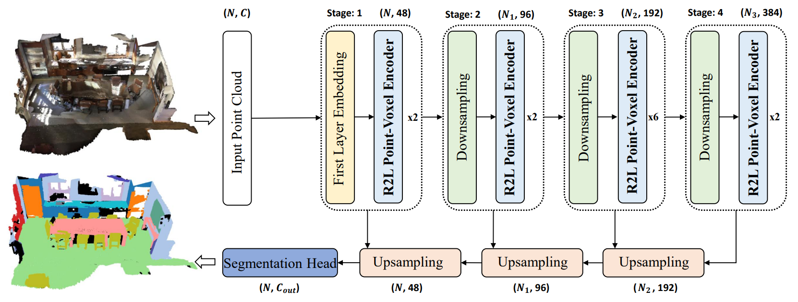
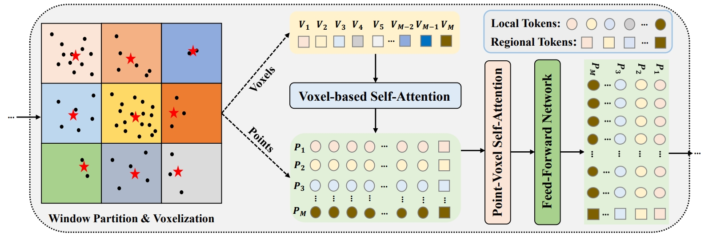

# RegionPVT
Repo of "Regional-to-Local Point-Voxel Transformer for Large-scale Indoor Semantic Segmentation". (The code is coming soon!) 

---
Semantic segmentation of large-scale indoor 3D point cloud scenes is crucial for scene understanding but faces challenges in effectively modeling long-range dependencies and multi-scale features. In this paper, we present **RegionPVT**, a novel Regional-to-Local Point-Voxel Transformer that synergistically integrates voxel-based regional self-attention and window-based point-voxel self-attention for concurrent coarse-grained and fine-grained feature learning. The voxel-based regional branch focuses on capturing regional context and facilitating inter-window communication. The window-based point-voxel branch concentrates on local feature learning while integrating voxel-level information within each window. This unique design enables the model to jointly extract local details and regional structures efficiently and provides an effective and efficient solution for multi-scale feature fusion and a comprehensive understanding of 3D point clouds. Extensive experiments on S3DIS and ScanNet v2 datasets demonstrate that our RegionPVT achieves competitive or superior performance compared with state-of-the-art approaches, attaining mIoUs of 71.0\% and 73.9\% respectively, with significantly lower memory footprint.

---
Bellow is the illustration of our Regional-to-Local (R2L) Point-Voxel Transformer Encoder. To make it intuitive, we present it in 2D domain. The red stars denote the voxels with features and black points indicate similar for point clouds. $V_{i}$ represents the $i$-th regional token, while $P_{i}$ denotes the corresponding local token set in the $i$-th window. All regional tokens (voxels) are first passed through the voxel-based regional self-attention (Voxel-based Self-attention) to exchange the information among neighboring voxels and then window-based point-voxel self-attention (Point-Voxel Self-Attention) performs parallel self-attention where each takes one regional token and corresponding local tokens (points). After that, all the tokens are passed through the feed-forward network and split back to the regional and local tokens. Finally, only the local tokens are passed to the next layer.

